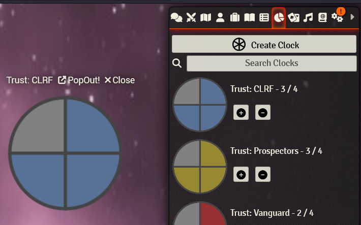
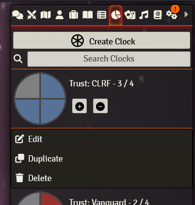

# Foundry VTT: Clock-Works

A simplistic module for running progress clocks like those found in [Blades In the Dark](https://bladesinthedark.com/progress-clocks) or various other Forged in the Dark games (for an excellent article on them, head [here](https://www.indiegamereadingclub.com/indie-game-reading-club/clocks-forged-in-the-darks-underappreciated-killer-app/)).

## Usage

Once the module is installed, you'll notice a new tab in your sidebar:

Within you'll find a list of all clocks. You can click one to pop it out onto the canvas. The plus and minus buttons serve to increment and decrement the clocks.

Clocks are synched across all players and can be edited by everyone.

By rightclicking, you can access the contents menu to edit, duplicate or delete the given clock

When editing a clock, you can adjust its size, segment count and colors. You can also set back- and foreground images if you want filled spaces to display a different image than empty ones.

## Attributions

Heavy inspiration for this project stems from these other fantastic modules (go check them out!):

- [Foundry VTT: Clocks by TyrannosaurusRoy](https://github.com/troygoode/fvtt-clocks)
- [Challenge Tracker by Russell](https://github.com/Larkinabout/fvtt-challenge-tracker/)

## License

This module is an open source project, licensed under the terms of the MIT License.

[MIT License](http://www.opensource.org/licenses/mit-license.php)
